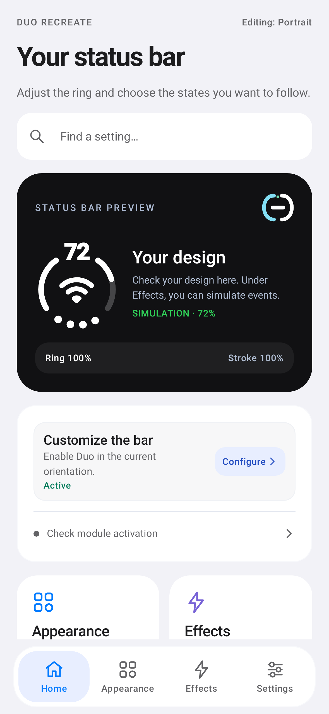
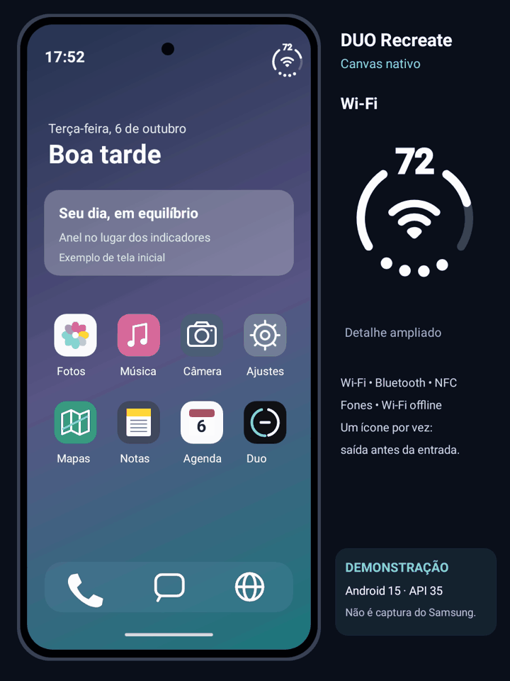

# DUO Recreate

[](https://github.com/edugrepo1-jpg/duoStatusBar/releases) [](https://github.com/edugrepo1-jpg/duoStatusBar/releases/latest) [](INSTALL.en.md)

[Português](../README.md) · **English** · [Español](README.es.md)

Battery and device states in a status bar ring. An independent **GPL-3.0** fork of [Duo Status Bar](https://github.com/kvmy666/duoStatusBar) by **kvmy666**, using Android Canvas throughout.

**[Download APK](https://github.com/edugrepo1-jpg/duoStatusBar/releases/tag/v1.4.4-recreate)** · [Interface ZIP](downloads/DUO-Recreate-interfaces.zip) · [Full gallery](GALERIA.md) · [All releases](https://github.com/edugrepo1-jpg/duoStatusBar/releases)

Requires **Android 13+, arm64 and a working LSPosed environment**. Package: `io.github.RECREATE.statusbar`. This is a preview release; local tests do not certify your OEM device.

 

**[LSPosed installation guide](INSTALL.en.md)**

## See the ring in action



Simulated demonstration: the production Canvas renderer draws the ring and effects in a native Android 15 (API 35) test environment. The phone shell and system screens are illustrative, not a Samsung recording or proof of One UI integration.

## What it does

- Canvas battery ring with percentage, signal dots and internal icons. Adjust size, position, thickness and icon scale up to 200%, independently for portrait/landscape.
- Twenty requested state categories: connectivity, airplane/DND/Bluetooth/NFC/hotspot, earbuds and their battery, unlock confirmation, charging, separate camera/microphone, alarm/VPN/GPS, silent/vibrate, media, wireless charging, flashlight, recording and offline Wi-Fi using the connected symbol with a red diagonal slash and fast pulse.
- Sequential fade out then fade in; exclusive three-second unlock check; charging glow, music waves/progress/color, charge estimate, screenshot shutter, volume and recording timer. The most recent music/recording event holds the center until it ends; paused music releases it.
- One to sixty seconds per secondary icon, universal or individual timing, separate entry/exit times, stroke reveal and network-only mode.
- Hold the ring for a compact island, drag down to expand states/media/battery/shortcuts, drag up on the header to collapse.
- **Visual → System panels:** independent notification and quick settings switches, each with a 50–200% size setting bounded by the actual header space.
- Interactive simulation before applying; system/light/dark themes; Portuguese, English and Spanish.

Unknown states are not invented. While Bluetooth headphones occupy the center, the ring and top number show their battery, then return to the phone battery. There is no duplicated label below the icon. Unknown headphone levels keep the phone battery. Customize **0–20%, 21–80% and 81–100%** colors in **Visual → Battery colors**. Sensors, media, screenshots and privacy indicators depend on Android/ROM access.

## Install and use

1. Download the APK under release **Assets**. Existing Recreate users can install over the previous release; package and signer are retained.
2. On first launch choose a language. Enable Recreate in LSPosed with **System UI** scope and restart. Disable older Duo modules to avoid duplicate injection.
3. Open **Home → Customize the bar → Configure**, then switch it on. Configure rows open an explanation and accessible switch over a blurred background; closing removes the blur.
4. Try the interactive preview under **Effects**. Simulation changes reach the bar only when you select **Apply to bar**.
5. Grant optional media/screenshot access under **Music and capture** only if needed. Restart System UI after an update to load the new module.

For migration from an earlier signed Canvas package, keep it installed until Recreate's first launch. One-time preference import excludes logs, privileged grants and root authorization.

## Diagnostics and maintenance

Save/share diagnostics under **Settings**, without granting root to the app. Reports include model/manufacturer, Android/kernel, module status, enabled/detected/executed features, unavailable states, failures and bounded work counters. Private identifiers and notification/music content are excluded. Review any text you add before sharing.

Battery observations concern the **whole phone**; they do not measure module-specific mAh or autonomy savings. No additional telemetry timer or wakelock is introduced. Open a missing notification/QS panel before collecting a report. Unrecognized headers retain stock icons.

[Executed validation](fork/VALIDACAO.md) · [This release](fork/UI-E-PAINEIS.md) · [Audit](fork/AUDITORIA.md) · [Complete history](fork/HISTORICO-COMPLETO.md)

Updates come from this fork, with SHA-256, package, installed signer and higher versionCode checks. Original developer support/contact and automatic log delivery are disabled; authorship and GPL remain.

Build with Java 17+, SDK/Build Tools 36 and Gradle 8.13:

```sh
./gradlew :app:testDebugUnitTest :app:assembleDebug
python3 tools/route-module-logs.py --check
```

Sign using your own protected key; a different signer cannot update an installed distribution. Do not commit keys or private logs. Rive archives are historical and are not included in the renderer/APK.

[License](../LICENSE) · [Original documentation](fork/UPSTREAM-README.md). Not affiliated with Apple, Samsung or Xiaomi. Real-device GPU blur, sensor behavior, OEM fit and battery autonomy remain device checks. Gallery images are native app renders with simulated states.
