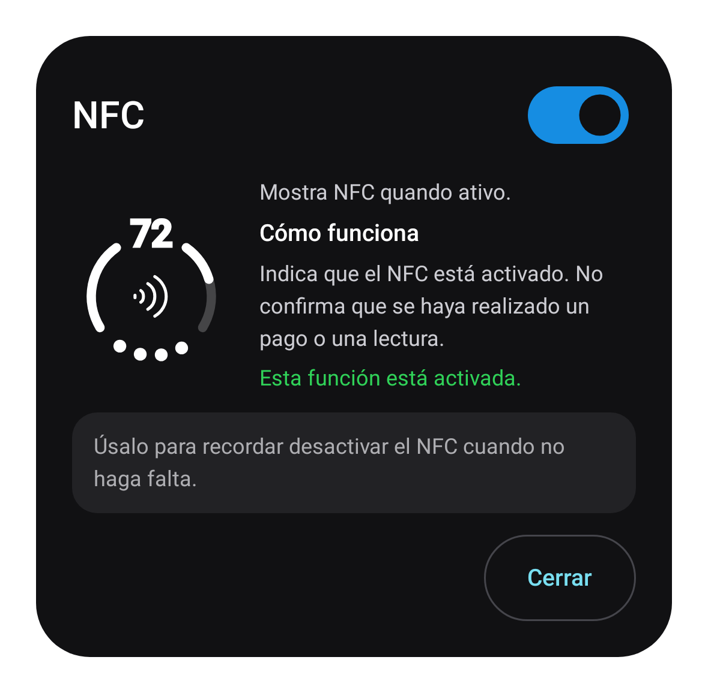
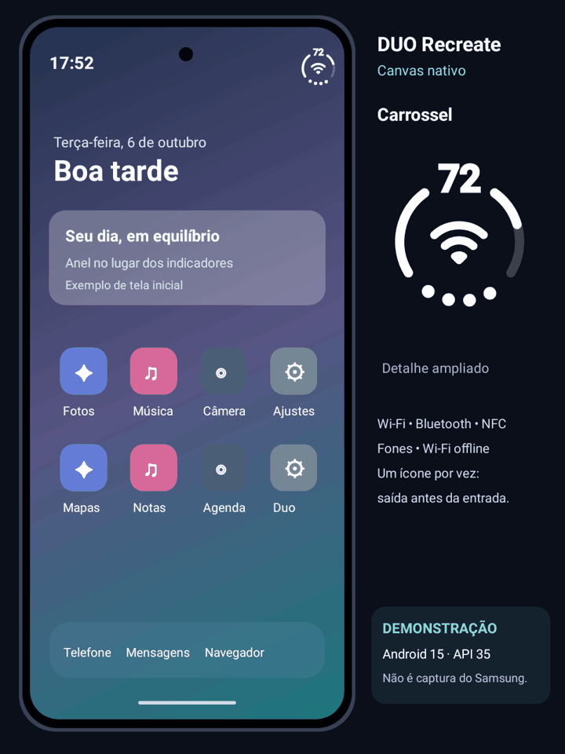

# DUO Recreate

[Português](../README.md) · [English](README.en.md) · **Español**

Batería y estados del dispositivo en un anillo de la barra de estado. Fork independiente **GPL-3.0** de [Duo Status Bar](https://github.com/kvmy666/duoStatusBar), de **kvmy666**, con Android Canvas.

**[Descargar APK](https://github.com/edugrepo1-jpg/duoStatusBar/releases/tag/v1.4.3-recreate)** · [ZIP de interfaces](downloads/DUO-Recreate-interfaces.zip) · [Galería completa](GALERIA.md) · [Versiones](https://github.com/edugrepo1-jpg/duoStatusBar/releases)

Requiere **Android 13+, arm64 y un entorno LSPosed funcional**. Paquete: `io.github.RECREATE.statusbar`. Es una versión preliminar; las pruebas locales no certifican tu dispositivo OEM.

 

## El anillo en acción



Demostración simulada: el Canvas de producción dibuja el anillo y los efectos en Android 15 (API 35) simulado. La carcasa y las pantallas del sistema son ilustrativas; no es una grabación de Samsung ni una validación de integración en One UI.

## Funciones

- Anillo Canvas con porcentaje, puntos de señal e iconos internos. Tamaño, posición, grosor y escala de iconos hasta 200%, con ajustes independientes por orientación.
- Veinte categorías solicitadas: Wi-Fi/datos, avión, No molestar, Bluetooth, NFC, punto de acceso, auriculares/batería, confirmación, carga, cámara y micrófono separados, alarma, VPN, GPS/brújula, silencio/vibración, música, inducción, linterna, grabación y Wi-Fi sin internet con `!` rojo.
- Primero termina la salida y luego entra el siguiente icono; confirmación exclusiva al desbloquear durante tres segundos; brillo de carga, ondas/progreso/color musical, estimación de carga, captura, volumen y tiempo de grabación. El evento musical/de grabación más reciente ocupa el centro hasta terminar; pausar la música lo libera.
- De 1 a 60 segundos por icono secundario, tiempo universal o individual, entrada/salida ajustables, dibujo de trazos y modo solo red.
- Mantén pulsado el anillo para abrir una isla compacta; desliza hacia abajo para expandir estados, batería, música y accesos. Desliza hacia arriba en la cabecera para contraer.
- **Visual → Paneles del sistema:** activación independiente en notificaciones y ajustes rápidos, cada uno con tamaño de 50–200%, limitado por el espacio físico.
- Simulación interactiva antes de aplicar, temas sistema/claro/oscuro y traducciones al portugués, inglés y español.

Los estados desconocidos no se inventan. La batería de auriculares solo se muestra si se informa: más de 15% verde; 15% o menos rojo. Sensores, música, capturas y privacidad dependen de las API y permisos de la ROM.

## Instalación y uso

1. Descarga el APK en **Assets** de la versión. Si ya utilizas Recreate, instala encima: conserva paquete, firma y ajustes.
2. Elige un idioma al iniciar. Activa Recreate en LSPosed con **System UI** como ámbito y reinicia. Desactiva módulos Duo antiguos para evitar dos inyecciones.
3. Abre **Inicio → Personalizar la barra → Configurar** y activa el interruptor azul. Las opciones Configurar muestran explicación y control sobre un fondo desenfocado; al cerrar desaparece el desenfoque.
4. Prueba la vista interactiva en **Efectos**. Los cambios simulados solo llegan a la barra al tocar **Aplicar en la barra**.
5. Concede accesos opcionales a música/capturas en **Música y captura**, si los necesitas. Reinicia System UI después de actualizar para cargar el módulo nuevo.

Para migrar desde el paquete Canvas anterior firmado, mantenlo instalado hasta abrir Recreate una vez. La importación única no incluye logs, permisos privilegiados ni autorización de root.

## Diagnósticos y mantenimiento

Guarda o comparte el diagnóstico en **Ajustes**, sin conceder root a la aplicación. Incluye fabricante, modelo, Android, kernel, módulo, funciones habilitadas/detectadas/ejecutadas, errores, estados sin acceso y contadores limitados. Excluye identificadores privados y contenido de notificaciones/música. Revisa cualquier texto que añadas antes de compartirlo.

La batería observada corresponde al **teléfono completo**; no mide mAh ni ahorro atribuible al módulo. La telemetría no añade temporizador ni wakelock. Abre el panel que falta antes de generar un diagnóstico. Las cabeceras no reconocidas conservan sus iconos originales.

[Validación ejecutada](fork/VALIDACAO.md) · [Cambios de esta versión](fork/UI-E-PAINEIS.md) · [Auditoría](fork/AUDITORIA.md) · [Historial completo](fork/HISTORICO-COMPLETO.md)

Las actualizaciones proceden de este fork, con comprobación SHA-256, paquete, firma instalada y código de versión superior. Se desactivaron el contacto/apoyo y envío automático de logs al desarrollador original; se conservan autoría y GPL.

Compila con Java 17+, SDK/Build Tools 36 y Gradle 8.13:

```sh
./gradlew :app:testDebugUnitTest :app:assembleDebug
python3 tools/route-module-logs.py --check
```

Firma con tu propia clave protegida. Una firma diferente no actualiza la distribución instalada. No publiques claves ni logs privados. Los archivos Rive históricos no se incluyen en el renderizador/APK.

[Licencia](../LICENSE) · [Documentación original](fork/UPSTREAM-README.md). Sin afiliación con Apple, Samsung o Xiaomi. El desenfoque GPU, los sensores, el ajuste OEM y la autonomía física requieren pruebas en el dispositivo. Las imágenes de la galería son renderizaciones nativas con estados simulados.
